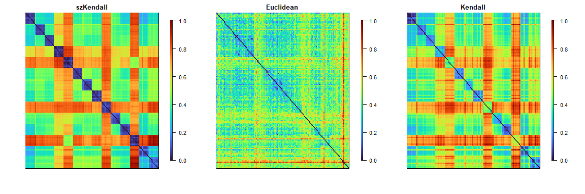

<!-- README.md is generated from README.Rmd. Please edit that file -->

# szKendall

<!-- badges: start -->

<!-- badges: end -->

The goal of szKendall is to measure the dissimilarity between two single
cells based on observed Hi-C data, accounting for the discrepancies in
structural zero positions.

## System Requirements

- R version: \>= 3.5
- Tested on: macOS 15.5, Windows 11
- Dependencies: None
- No special hardware required

## Installation

You can install the szKendall package from GitHub:

``` r
library(devtools)
devtools::install_github("https://github.com/swl0923/szKendall_trial")
```

The installation would take a few minutes on a standard desktop
computer.

## Example

This is an example which shows you how to calculate the szKendall
dissimilarity between cells. The `PFC_subset_matrix` dataset consists of
chr21 single-cell Hi-C contact matrices generated from 14 human
prefrontal cortex (PFC) cell types, with 10 cells sampled from each
type. Each matrix represents loci-pair-by-cell contact profiles that
have been pre-processed using the R package `HiCImpute`. With sequential
calculation, the calculation time of one szKendall dissimilarity in this
example is less than 1 minute using 19 cores. It may take longer when
using fewer cores.


``` r
library(szKendall)
data("PFC_subset_matrix")

foreach::registerDoSEQ()
res <- szKendall(contacts=PFC_subset_matrix,dist.method="szKendall", heatmap=TRUE)
```



`szKendall()` takes three types of input formats:

- a list of scHi-C 2D matrices of size $n$ (e.g., number of bins per
  chromosome)
- a 3D array of dimension $(n \times n \times \text{number of cells})$
- a $(\text{number of locus-pairs} \times \text{number ofcells})$ matrix

``` r
# A list n*n matrices, one per cell. 
data("PFC_subset_list")
szKendall(PFC_subset_list,dist.method="szKendall")

# An array of dimension n * n * (number of cells)
data("PFC_subset_array")
szKendall(PFC_subset_array,dist.method="szKendall")
```

`szKendall()` returns a list of three $n \times n$ symmetric matrices:

1.  a **szKendall dissimilarity** matrix
2.  a **Euclidean distance** matrix
3.  a **Kendall dissimilarity** matrix

``` r
dim(res[[1]]) # szKendall or szKendall1
#> [1] 140 140
dim(res[[2]]) # Euclidean 
#> [1] 140 140
dim(res[[3]]) # Kendall 
#> [1] 140 140
```
