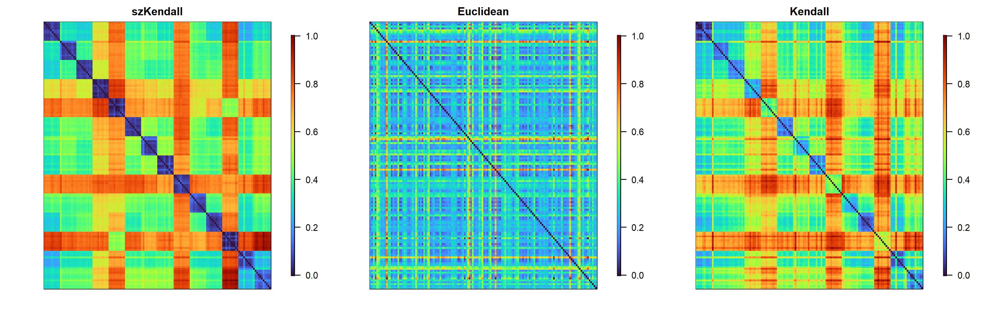

<!-- README.md is generated from README.Rmd. Please edit that file -->

# szKendall

<!-- badges: start -->

<!-- badges: end -->

The goal of szKendall is to measure the dissimilarity between two single
cells based on their observed Hi-C data, accounting for the
discrepancies in structural zero positions.

## System Requirements

- R version: \>= 3.5
- Tested on: macOS 15.5, Windows 11
- Dependencies: None
- No special hardware required

## Installation

You can install the szKendall package from GitHub:

``` r
library(devtools)
devtools::install_github("https://github.com/swl0923/szKendall_trial")
```

The installation would take a few minutes on a standard desktop
computer.

## Example

This is an example which shows you how to calculate the szKendall
dissimilarity between cells.The `PFC_subset` dataset consists of chr21
single-cell Hi-C contact matrices generated from 14 human prefrontal
cortex (PFC) cell types, with 10 cells sampled from each type. Each
matrix represents loci-pair-by-cell contact profiles that have been
pre-processed using . With sequential calculation, the calculation time
of one szKendall dissimilarity in this example should be less than 2
minutes, and half (or even less) with parallel computing.

``` r
library(szKendall)
data("PFC_subset")

foreach::registerDoSEQ()
res <- szKendall(PFC_subset,dist.method="szKendall")
```

`szKendall()` returns a list of three $n \times n$ symmetric matrices:

1.  the **szKendall dissimilarity** matrix

2.  the **Euclidean distance** matrix

3.  the **Kendall dissimilarity** matrix

in that order.


